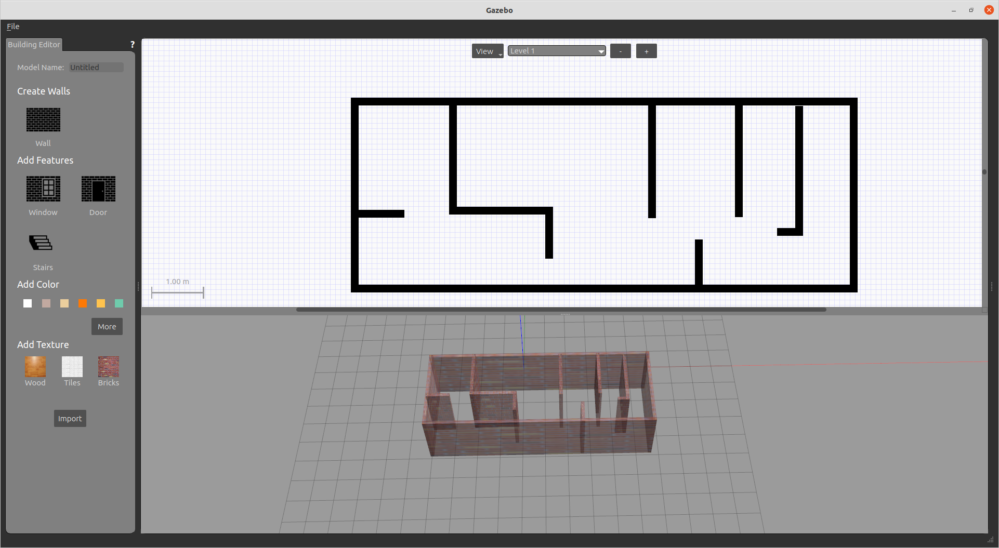
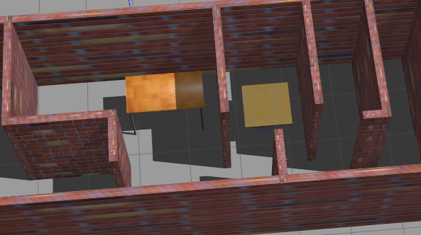
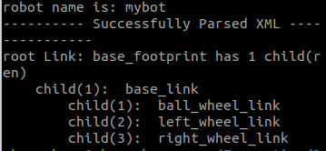
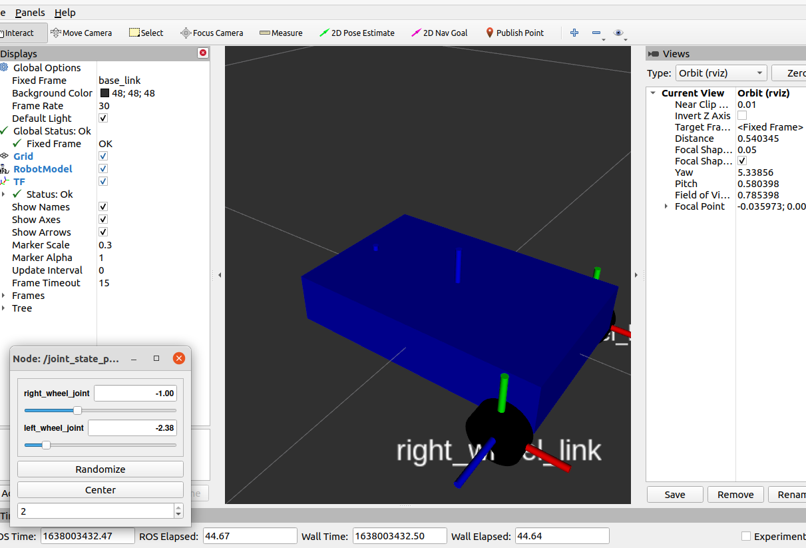

# Gazebo 机器人仿真学习笔记

## 一、实验准备

1. 参考视频教程：[《70分钟快速入门Gazebo机器人仿真》](https://www.bilibili.com/video/BV143411C75B?from=search&seid=11275725491542862099&spm_id_from=333.337.0.0)。

2. 实验用功能包：
```bash
git clone https://gitee.com/bingda-robot/bingda_tutorials
```

3. 一些第三方的功能包


## 二、world模型搭建

   ### 1)安装Gazebo官方的模型库

```bash
git clone https://gitee.com/bingda-robot/gazebo_models
```

clone结束以后找到/home/.gazebo，里面有个models，需要把刚才下载的文件放进去。

这一步可能遇到的问题：Gazebo有时无法弹出文件管理器，这时候最小化一下再打开就好了。但我用物理机装ubuntu20.04和noetic没发现这个问题，猜测可能和虚拟机有关。

### 2)自建模型

1. 点击标题栏中的Edit->building editor即可，左侧可以选择贴图等，弄好以后点file保存并退出



2. 退出以后就可以看到自己的模型在世界里了，可以添加一些小物件，再把世界保存好



3. 使用时放进功能包中的world文件夹，并且修改launch文件。

```xml
<launch>
  <include file="$(find gazebo_ros)/launch/empty_world.launch">
      <!--   我的文件名叫myroom，所以如下一行修改 -->
      <arg name="world_name" value="$(find bingda_tutorials)/world/myroom"/>
    
      <arg name="paused" value="false"/>
    <arg name="use_sim_time" value="true"/>
    <arg name="gui" value="true"/>
    <arg name="headless" value="false"/>
    <arg name="debug" value="false"/>
  </include>
</launch>
```


## 三、机器人模型搭建

### URDF文件简介

- [ROS官网的介绍](https://wiki.ros.org/urdf)
- [URDF的标签](https://wiki.ros.org/urdf/XML)，常用的有robot，link，joint
- 示例

```xml
<?xml version="1.0"?>  


<robot name="mybot">  
  <!-- 起始标签 -->
  
  <link name="base_footprint"/>
  <!-- ROS中约定俗成的一个坐标名称，其实是一个“空“坐标，没有惯性，视觉等
       ROS中，base_link指的是机器人本体的坐标，而base_footprint指的是base_link的投影 -->
  
  <joint name="base_joint" type="fixed">  
    <parent link="base_footprint"/>  
    <child link="base_link"/>  
    <origin rpy="0 0 0" xyz="0 0 0"/>  
  </joint>  
  
  <link name="base_link">  
    <!-- 惯性参数 -->
    <inertial>
     <origin xyz="0 0 0" rpy="0 0 0"/>
     <mass value="0.1"/>
     <inertia ixx="0.0001"  ixy="0"  ixz="0" iyy="0.0001" iyz="0" izz="0.001" />
    </inertial>

    <!-- 视觉参数 -->
    <visual>  
      <geometry>  
        <box size="0.25 0.16 0.05"/>  
      </geometry>  
      <origin rpy="0 0 0" xyz="0 0 0"/>  
      <material name="blue">  
          <color rgba="0 0 0.8 1"/>  
      </material>  
    </visual>  

    <!-- 碰撞参数 -->
    <!-- 一般设置与视觉相同，这样的话就可以肉眼看到是否碰撞 -->
   <collision>
     <origin xyz="0 0 0" rpy="0 0 0"/>
     <geometry>
       <box size="0.25 0.16 0.05"/>
     </geometry>
   </collision>

  </link>  
 
  <link name="right_wheel_link">  
    <inertial>
     <origin xyz="0 0 0" rpy="0 0 0"/>
     <mass value="0.1"/>
     <inertia ixx="0.0001"  ixy="0"  ixz="0" iyy="0.0001" iyz="0" izz="0.0001" />
    </inertial>

    <visual>  
      <geometry>  
        <cylinder length="0.02" radius="0.025"/>  
      </geometry>  
      <material name="black">  
        <color rgba="0 0 0 1"/>  
      </material>  
    </visual>  

    <collision>
     <origin xyz="0 0 0" rpy="0 0 0"/>
     <geometry>
       <cylinder length="0.02" radius="0.025"/> 
     </geometry>
    </collision>
  </link>  
 
  <joint name="right_wheel_joint" type="continuous">  
    <axis xyz="0 0 -1"/>  
    <parent link="base_link"/>  
    <!-- 将本体↑和轮子↓连接 -->
    <child link="right_wheel_link"/>  
    <origin rpy="1.5707 0 0" xyz=" 0.1 -0.09 -0.03"/>  
  </joint>  
 
  <link name="left_wheel_link">  
    <inertial>
     <origin xyz="0 0 0" rpy="0 0 0"/>
     <mass value="0.1"/>
     <inertia ixx="0.0001"  ixy="0"  ixz="0" iyy="0.0001" iyz="0" izz="0.0001" />
    </inertial>

    <visual>  
      <geometry>  
        <cylinder length="0.02" radius="0.025"/>  
      </geometry>  
      <material name="black">  
        <color rgba="0 0 0 1"/>  
      </material>  
    </visual>  

    <collision>
     <origin xyz="0 0 0" rpy="0 0 0"/>
     <geometry>
       <cylinder length="0.02" radius="0.025"/> 
     </geometry>
    </collision>   
  </link>  
 
  <joint name="left_wheel_joint" type="continuous">  
    <axis xyz="0 0 -1"/>  
    <parent link="base_link"/>  
    <child link="left_wheel_link"/>  
    <origin rpy="1.5707 0 0" xyz="0.1 0.09 -0.03"/>  
  </joint>  
 
  <link name="ball_wheel_link">  
    <inertial>
     <origin xyz="0 0 0" rpy="0 0 0"/>
     <mass value="0.1"/>
     <inertia ixx="0"  ixy="0"  ixz="0" iyy="0" iyz="0" izz="0" />
    </inertial>

    <visual>  
      <geometry>  
        <sphere radius="0.025"/>  
      </geometry>  
      <material name="black">  
        <color rgba="0 0 0 1"/>  
      </material>  
    </visual>  

    <collision>
     <origin xyz="0 0 0" rpy="0 0 0"/>
     <geometry>
       <sphere radius="0.025"/> 
     </geometry>
    </collision>   
  </link>  

  <joint name="ball_wheel_joint" type="fixed">  
    <axis xyz="0 0 1"/>  
    <parent link="base_link"/>  
    <child link="ball_wheel_link"/>  
    <origin rpy="0 0 0" xyz="-0.10 0 -0.03"/>  
  </joint>  

</robot>
```

- 可以运行check_urdf来检查

  - 首先要cd到存放urdf的目录下

    ```bash
    check_urdf yoururdf.urdf
    ```

  - 此处可能提示找不到命令，安装一下工具即可

    ```bash
    sudo apt install liburdfdom-tools
    ```

  - 成功运行以后应该显示出link情况

    

- 同样可以用launch文件来使用它，下面的指令用于在rviz中观察

  ```bash
  roslaunch bingda_tutorials display_robot.launch 
  ```

  

- ​	同样，gazebo中启动也需要用到launch文件

  ```xml
  <launch>
  
    <include file="$(find bingda_tutorials)/launch/gazebo_world.launch"/>
    <!--先启动我们的世界-->
    
      <node name="spawn_model"  pkg="gazebo_ros"  type="spawn_model" args="-file $(find bingda_tutorials)/urdf/mybot.urdf -urdf -model robot_description" output="screen" />
  
  </launch>
  ```

  ## 四、传感器和执行器的安装

  ### xacro文件简介

  1. xacro文件是urdf文件的一种补充和完善

  2. 示例的xacro文件与urdf文件主要不同如下

     - 安装一些传感器link
  
     ```xml
       
       <!-- imu sensor -->
       <link name="imu">  
         <visual>  
           <geometry>  
             <box size="0.01 0.01 0.01"/>  
           </geometry>  
           <material name="white">  
               <color rgba="1 1 1 1"/>  
           </material>  
         </visual>  
       </link>  
     
       <joint name="imu_joint" type="fixed">  
         <parent link="base_link"/>  
         <child link="imu"/>  
         <origin xyz="0.08 0 0.025"/>  
       </joint> 
     
       <!-- camera -->
       <link name="base_camera_link">  
         <visual>  
           <geometry>  
             <box size="0.02 0.03 0.03"/>  
           </geometry>  
           <material name="white">  
               <color rgba="1 1 1 1"/>  
           </material>  
         </visual>  
       </link>  
     
       <joint name="camera_joint" type="fixed">  
         <parent link="base_link"/>  
         <child link="base_camera_link"/>  
         <origin xyz="0.1 0 0.025"/>  
       </joint> 
       <!-- laser lidar -->
       <link name="base_laser_link">  
         <visual>  
           <geometry>  
             <cylinder length="0.06" radius="0.04"/>   
           </geometry>  
           <material name="white">  
               <color rgba="1 1 1 1"/>  
           </material>  
         </visual>  
       </link>  
       
       <joint name="laser_joint" type="fixed">  
         <parent link="base_link"/>  
         <child link="base_laser_link"/>  
         <origin xyz="0 0.0 0.06"/>  
       </joint> 
     ```
     
     - 引用xacro文件，好比C的h文件
     ```xml
       <robot name="mybot" xmlns:xacro="http://ros.org/wiki/xacro">  
       
         <xacro:include filename="$(find bingda_tutorials)/urdf/mybot.gazebo.xacro" /> 
     ```
     
  3.   最好把模型xacro文件和仿真相关的文件分开，这样可以提高我们的代码的复用性
  
  4. 关于gazebo仿真的xacro文件
  
     [Tutorial: Using a URDF in Gazebo](http://gazebosim.org/tutorials?tut=ros_urdf&cat=connect_ros) 这个连接详细讲解了标签的用法和含义
  
     [Tutorial: Using Gazebo plugins with ROS](http://gazebosim.org/tutorials?tut=ros_gzplugins) 传感器和雷达要使用plugin的方式插入
  
     ```xml
     <?xml version="1.0"?>
     <robot name="mybot" xmlns:xacro="http://ros.org/wiki/xacro">
       <xacro:arg name="laser_visual" default="false"/>
       <xacro:arg name="camera_visual" default="false"/>
       <xacro:arg name="imu_visual"   default="false"/>
     
       <gazebo reference="base_link">
         <material>Gazebo/DarkGrey</material>
       </gazebo>
     
       <gazebo reference="left_wheel_link">
         <mu1>0.5</mu1>
         <mu2>0.5</mu2>
         <kp>500000.0</kp>
         <kd>10.0</kd>
         <minDepth>0.001</minDepth>
         <maxVel>1.0</maxVel>
         <fdir1>1 0 0</fdir1>
         <material>Gazebo/DarkGrey</material>
       </gazebo>
     
       <gazebo reference="right_wheel_link">
         <mu1>0.5</mu1>
         <mu2>0.5</mu2>
         <kp>500000.0</kp>
         <kd>10.0</kd>
         <minDepth>0.001</minDepth>
         <maxVel>1.0</maxVel>
         <fdir1>1 0 0</fdir1>
         <material>Gazebo/FlatBlack</material>
       </gazebo>
     
       <gazebo reference="ball_wheel_link">
         <mu1>0.1</mu1>
         <mu2>0.1</mu2>
         <kp>500000.0</kp>
         <kd>100.0</kd>
         <minDepth>0.001</minDepth>
         <maxVel>1.0</maxVel>
         <material>Gazebo/FlatBlack</material>
       </gazebo>
     
       <gazebo reference="imu">
         <sensor type="imu" name="imu">
           <always_on>true</always_on>
           <visualize>$(arg imu_visual)</visualize>
         </sensor>
         <material>Gazebo/FlatBlack</material>
       </gazebo>
     
         <!-- 速度控制器 -->
       <gazebo>
         <plugin name="mybot_controller" filename="libgazebo_ros_diff_drive.so">
           <commandTopic>cmd_vel</commandTopic>
           <odometryTopic>odom</odometryTopic>
           <odometryFrame>odom</odometryFrame>
           <odometrySource>world</odometrySource>
           <publishOdomTF>true</publishOdomTF>
           <robotBaseFrame>base_footprint</robotBaseFrame>
           <publishWheelTF>false</publishWheelTF>
           <publishTf>true</publishTf>
           <publishWheelJointState>true</publishWheelJointState>
           <legacyMode>false</legacyMode>
           <updateRate>30</updateRate>
           <leftJoint>left_wheel_joint</leftJoint>
           <rightJoint>right_wheel_joint</rightJoint>
           <wheelSeparation>0.180</wheelSeparation>
           <wheelDiameter>0.05</wheelDiameter>
           <wheelAcceleration>10</wheelAcceleration>
           <wheelTorque>100</wheelTorque>
           <rosDebugLevel>na</rosDebugLevel>
         </plugin>
       </gazebo>
     
       <gazebo>
         <plugin name="imu_plugin" filename="libgazebo_ros_imu.so">
           <alwaysOn>true</alwaysOn>
           <bodyName>imu</bodyName>  
           <frameName>imu</frameName>
           <topicName>imu</topicName>
           <serviceName>imu_service</serviceName>
           <gaussianNoise>0.0</gaussianNoise>
           <updateRate>0</updateRate>
           <imu>
             <noise>
               <type>gaussian</type>
               <rate>
                 <mean>0.0</mean>
                 <stddev>2e-4</stddev>
                 <bias_mean>0.0000075</bias_mean>
                 <bias_stddev>0.0000008</bias_stddev>
               </rate>
               <accel>
                 <mean>0.0</mean>
                 <stddev>1.7e-2</stddev>
                 <bias_mean>0.1</bias_mean>
                 <bias_stddev>0.001</bias_stddev>
               </accel>
             </noise>
           </imu>
         </plugin>
       </gazebo>
     
       <gazebo reference="base_laser_link">
         <material>Gazebo/FlatBlack</material>
         <sensor type="ray" name="rplidar_sensor">
           <pose>0 0 0 0 0 0</pose>
           <visualize>$(arg laser_visual)</visualize>
           <update_rate>7</update_rate>
           <ray>
             <scan>
               <horizontal>
                 <samples>720</samples>
                 <resolution>0.5</resolution>
                 <min_angle>0.0</min_angle>
                 <max_angle>6.28319</max_angle>
               </horizontal>
             </scan>
             <range>
               <min>0.120</min>
               <max>12.0</max>
               <resolution>0.015</resolution>
             </range>
             <noise>
               <type>gaussian</type>
               <mean>0.0</mean>
               <stddev>0.01</stddev>
             </noise>
           </ray>
           <plugin name="gazebo_ros_rplidar_controller" filename="libgazebo_ros_laser.so">
             <topicName>scan</topicName>
             <frameName>base_laser_link</frameName>
           </plugin>
         </sensor>
       </gazebo>
     
       
       <gazebo reference="base_camera_link">
         <sensor type="camera" name="csi Camera">
           <always_on>true</always_on>
           <visualize>$(arg camera_visual)</visualize>
           <camera>
               <horizontal_fov>1.085595</horizontal_fov>
               <image>
                   <width>640</width>
                   <height>480</height>
                   <format>R8G8B8</format>
               </image>
               <clip>
                   <near>0.03</near>
                   <far>100</far>
               </clip>
           </camera>
           <plugin name="camera_controller" filename="libgazebo_ros_camera.so">
             <alwaysOn>true</alwaysOn>
             <updateRate>30.0</updateRate>
             <cameraName>/</cameraName>
             <frameName>base_camera_link</frameName>
             <imageTopicName>image_raw</imageTopicName>
             <cameraInfoTopicName>camera_info</cameraInfoTopicName>
             <hackBaseline>0.07</hackBaseline>
             <distortionK1>0.0</distortionK1>
             <distortionK2>0.0</distortionK2>
             <distortionK3>0.0</distortionK3>
             <distortionT1>0.0</distortionT1>
             <distortionT2>0.0</distortionT2>
           </plugin>
         </sensor>
       </gazebo>
     
     </robot>
     
     ```
  
  5. 启动文件
  
     ```xml
     <launch>
       <arg name="x_pos" default="0.0"/>
       <arg name="y_pos" default="0.0"/>
       <arg name="z_pos" default="0.0"/>
       <param name="/use_sim_time" value="true" />  
       
        <!-- 先启动环境-->
       <include file="$(find bingda_tutorials)/launch/gazebo_world.launch"/>
       
       
        <!--启动机器人描述，生成机器人-->
       <param name="robot_description" command="$(find xacro)/xacro --inorder $(find bingda_tutorials)/urdf/mybot.xacro" />
       <node pkg="gazebo_ros" type="spawn_model" name="spawn_urdf" args="-urdf -model mybot.xacro -x $(arg x_pos) -y $(arg y_pos) -z $(arg z_pos) -param robot_description" />
        
        <!--启动一个控制器-->
       <node name="robot_state_publisher" pkg="robot_state_publisher" type="robot_state_publisher" />
     
     </launch>
     ```
     
6. 启动launch文件后，我门可以用如下指令来查看话题情况
     ```bash
     rostopic list
     rostopic info
     ```

7. 最后启动键盘控制节点可以控制小车运动
